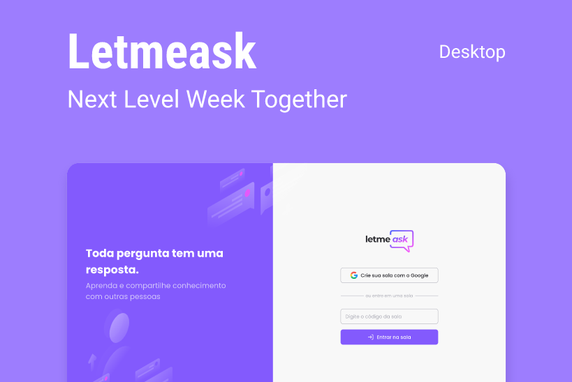

<h1 align="center">
    
</h1>

<h1 align="center">
    
</h1>

# 💻 Sobre o projeto
A plataforma Letmeask foi desenvolvido pensando em criadores de conteúdo, no qual, eles podem criar salas de Q&A com seu público, de uma forma que seja democrática e organizada.

Projeto desenvolvido durante a 🚀 **NLW - Next Level Week** 🚀 - Oferecida pela **Rocketseat**

---

## 🚨 Como baixar o projeto
Antes de começar, você vai precisar ter instalado em sua máquina as seguintes ferramentas: Git, Node.js e Expo. Além disto ter um editor para trabalhar com o código como VSCode

### 🏁 Para rodar a aplicação 

```bash

    # Clonar o repositório
    $ git clone https://github.com/milealmeida/nlw-reactjs-letmeask

    # Entrar no diretório
    $ cd {nomepasta}

    # Instalar as dependências
    $ yarn install

    # Iniciar o projeto no terminal
    $ yarn start

```

Lembrando que será necessário criar uma conta no Firebase e um projeto para disponibilizar um Realtime Database.

---
Desenvolvido por Milena Almeida 💙